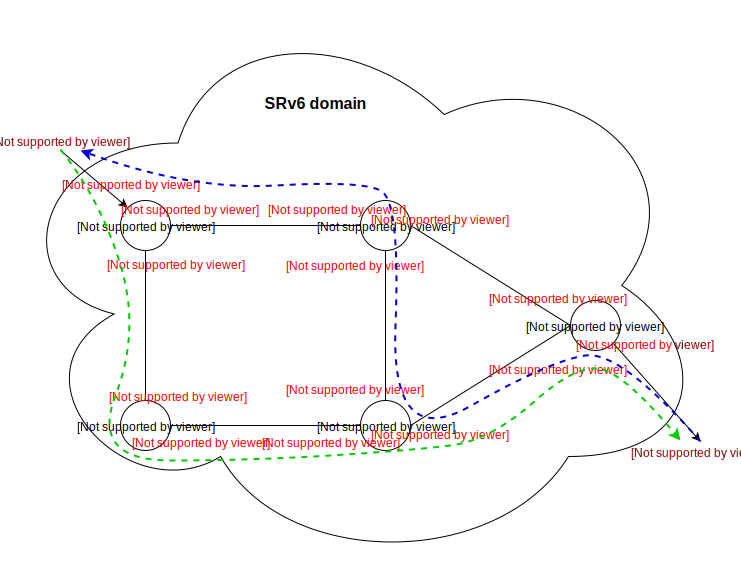

= SRv6-5 node Demo

Requirements::

- docker
- deb packages for honeycomb (hc2vpp) and vpp

Usage::

. download or build vpp and honeycomb deb packages and place them inside _"../packages"_ folder:
- honeycomb-*.deb (hc2vpp is required, use _"hc2vpp/packaging/deb/xenial/debuild.sh"_ to build deb package locally)
- vpp-*.deb
- vpp-lib*.deb
- vpp-plugins*.deb
- you can download vpp packages from
https://nexus.fd.io/content/repositories/fd.io.master.ubuntu.xenial.main/io/fd/[Nexus Fd.io]

. Run the script _"./create_image.sh"_ in parent directory to create docker image with HC and VPP pre-installed.
It should be added to docker automatically (a tar file of the image can be created as backup, see content of
create_image.sh).
. Start the demo using _"start_demo.sh <demo_type>"_ script where _<demo_type>_ is _"vpp"_ for vpp only setup or _"hc"_
for setup with honeycomb
. Clean everything with "clean_demo.sh" script
. if you need to restart the whole demo use _"restart_demo.sh <demo_type>"_. You don't have to use the same demo type as
in start_demo script. Current setup will be cleaned and started as a fresh demo.

Topology::

- 5VPP nodes (*vppA* = A::, *vppB* = B::, *vppC* = C::, *vppD* = D::, *vppE* = E::)
- each node was preassigned with IPv6 addresses on host-veth interfaces (marked red)
- green dashed line represents how traffic should flow from source to the destination
- blue dashed line represents return traffic from destination back to source

Testing/debuging::

. to list configuration for all nodes use `./show_configuration.sh` script
. to test ping for IPv6 use:
- *hostA:* +
_sudo ip netns exec VNET_A ping6 E::1_ +
_sudo ip netns exec VNET_A ping6 E::1 -c 1000 -s 1024 -i 0.0001_ (for bigger flow)
- *hostE:* +
_sudo ip netns exec VNET_E ping6 A::1_ +
_sudo ip netns exec VNET_E ping6 A::1 -c 1000 -s 1024 -i 0.0001_ (for bigger flow)

. to run packet trace simply use _"pcap_vpp.sh"_ script +
e.g. ./pcap_vpp.sh <nodeName> <packetCount> +
_"./pcap_vpp.sh vppA 3"_ +

. to observe packet flow use _"watch_int_vpp.sh"_ script +
e.g. ./watch_int_vpp.sh <nodeName> +
_"./watch_int_vpp.sh vppA"_

. to check the packet flow on hostE use tcpdump: +
`sudo ip netns exec VNET_E tcpdump -i vethE -vv -c 4`

Sample packet capture on hostE::
....
sudo ip netns exec VNET_E tcpdump -i vethE -vv -c 4

tcpdump: listening on vethE, link-type EN10MB (Ethernet), capture size 262144 bytes
12:21:00.210165 IP6 (flowlabel 0x3d90e, hlim 62, next-header ICMPv6 (58) payload length: 64) a::1 > e::1: [icmp6 sum ok] ICMP6, echo request, seq 285
12:21:00.210250 IP6 (flowlabel 0x8fd85, hlim 64, next-header ICMPv6 (58) payload length: 64) e::1 > a::1: [icmp6 sum ok] ICMP6, echo reply, seq 285
12:21:01.213350 IP6 (flowlabel 0x3d90e, hlim 62, next-header ICMPv6 (58) payload length: 64) a::1 > e::1: [icmp6 sum ok] ICMP6, echo request, seq 286
12:21:01.213435 IP6 (flowlabel 0x8fd85, hlim 64, next-header ICMPv6 (58) payload length: 64) e::1 > a::1: [icmp6 sum ok] ICMP6, echo reply, seq 286
4 packets captured
4 packets received by filter
0 packets dropped by kernel
....

Usefull VPP commands::

Note: to use vpp commands for this demo use syntax like this: +
`"sudo docker exec vppC vppctl sh hardware"`

- vppctl show hardware (show interfaces with L2 addresses)
- vppctl show int (show interfaces with counters)
- vppctl show int address (show interfaces with L3 addresses)
- vppctl show sr localsids (shows local sid table)
- vppctl show sr policies (list of configured SR policies)
- vppctl show sr steering-policies (list of configured steering SR policies)
- vppctl show ip6 fib (shows routing table)
- vppctl show ip6 fib <dst_ip_mask> (shows routing table and filter matches by destination IP)
